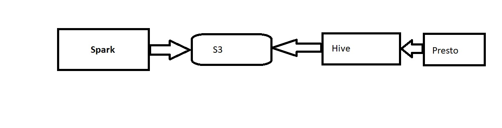

# lendingclubetl

Used Hive as database to store the data
Used Spark for cleaning, validation and storing the data in hive in parquet format. 
 
Checked null/empty value count by executing below code in scala
 
 ```
  csvDataFrame.columns.foreach(c =>
      Console.println(c,
        csvDataFrame.filter(csvDataFrame(c.toString).isNull || csvDataFrame(c.toString) === "").count()
      )
    )
 ```

Application accepts two parameters. 
1.  Input path
2.  Output path

Output path can be ***S3 location***/HDFS location.
Hive table is created on top of the output location.
Report queries can be stored in hive tables by executing queries on the base table.
***Presto*** can be used for ad-hoc queries on top of hive metastore.

***Architecture***


